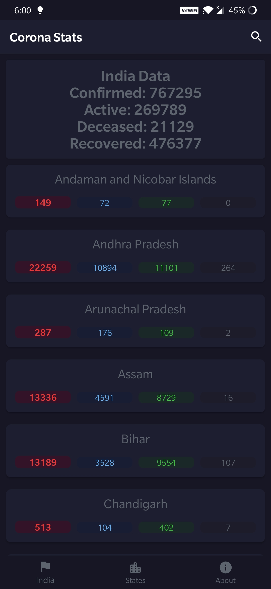
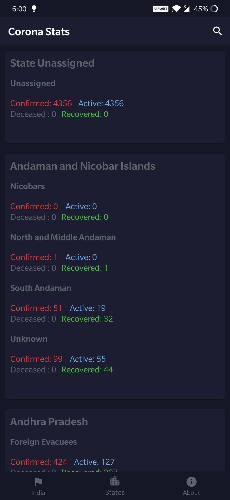
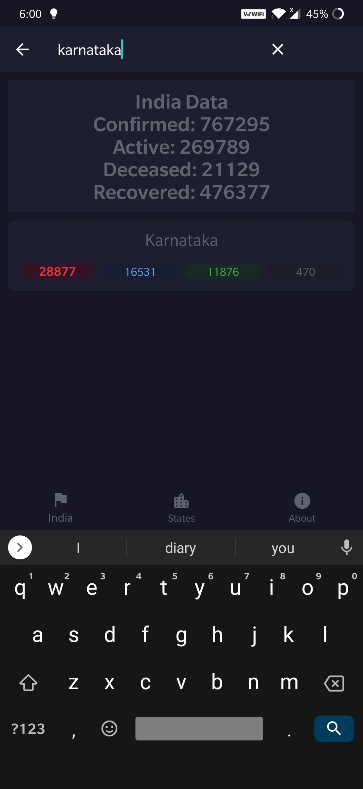

# Corona India Statistics
Capturing minimalistic information related to India's COVID-19 Situation 

---

## APP
### Dark Mode
<table>
  <tr>
    <td>First Page</td>
    <td>Second Page</td>
    <td>Search</td>
  </tr>
  <tr>
    <td></td>
    <td></td>
    <td></td>
  </tr>
</table>

---

## APIs  
The statistics that are displayed in the app are taken from this [api](https://api.covid19india.org/data.json)  

---

## General Outcome  
Understanding concepts of kotlin

---